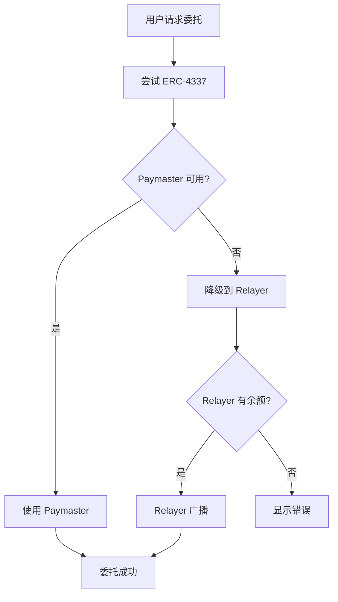

# EIP-7702 混合委托实现方案

## 📋 目录
1. [问题分析](#问题分析)
2. [解决方案](#解决方案)
3. [技术架构](#技术架构)
4. [完整代码实现](#完整代码实现)
5. [测试计划](#测试计划)
6. [部署流程](#部署流程)

## 问题分析

### 核心挑战
EIP-7702 委托首次设置需要用户支付 ETH Gas，但这违背了"零门槛入 Web3"的目标。

### 技术难点
1. **EIP-7702 交易限制**: Type 0x04 交易无法直接使用 Paymaster
2. **SBT 前置依赖**: SBT 需要 GToken stake 或购买，对无 ETH 用户是障碍
3. **可靠性要求**: 必须确保用户 100% 能成功设置委托

## 解决方案

### 混合策略：ERC-4337 + Relayer

#### 方案对比

| 特性 | ERC-4337 Paymaster | Relayer直接支付 | 混合方案 |
|------|-------------------|-----------------|----------|
| 成本 | 低 (协议支付) | 高 (Relayer自付) | 优化 (智能选择) |
| 可靠性 | 中 (依赖bundler) | 高 (直接广播) | 极高 (双重保障) |
| 可扩展性 | 高 (去中心化) | 低 (中心化) | 平衡 (渐进式) |
| 实现复杂度 | 高 | 低 | 中 |

### 降级策略



## 技术架构

### 系统组件

1. **前端 (aastar-frontend)**
   - 检测用户 ETH 余额
   - 构造委托交易
   - 处理签名流程
   - 状态反馈

2. **后端 (aastar)**
   - DelegationService 混合服务
   - Paymaster 集成
   - Relayer 服务
   - 监控和优化

3. **智能合约**
   - DelegationFactory (已部署)
   - MinimalDelegationContract (已部署)
   - SponsorPaymaster (新增)

4. **基础设施**
   - ERC-4337 Bundler (Pimlico)
   - Relayer 服务
   - 监控系统

## 完整代码实现

### 1. SponsorPaymaster 合约

```solidity
// SPDX-License-Identifier: MIT
pragma solidity ^0.8.24;

import "@openzeppelin/contracts/token/ERC20/IERC20.sol";
import "account-abstraction/interfaces/IEntryPoint.sol";
import "account-abstraction/interfaces/IPaymaster.sol";

/**
 * @title SponsorPaymaster
 * @notice 专门赞助 EIP-7702 委托设置的 Paymaster
 */
contract SponsorPaymaster is IPaymaster {
    /*//////////////////////////////////////////////////////////////
                                 ERRORS
    //////////////////////////////////////////////////////////////*/
    error Unauthorized();
    error InsufficientBalance();
    error InvalidTarget();
    error AlreadyDelegated();
    error InvalidSignature();
    error DailyLimitExceeded();

    /*//////////////////////////////////////////////////////////////
                                 EVENTS
    //////////////////////////////////////////////////////////////*/
    event UserOpSponsored(
        address indexed user,
        bytes32 indexed userOpHash,
        uint256 actualGasCost
    );

    /*//////////////////////////////////////////////////////////////
                            IMMUTABLE STORAGE
    //////////////////////////////////////////////////////////////*/
    IEntryPoint public immutable entryPoint;
    address public immutable owner;
    IERC20 public immutable xPNTsToken;
    uint256 public immutable sponsorshipCap;

    /*//////////////////////////////////////////////////////////////
                            MUTABLE STORAGE
    //////////////////////////////////////////////////////////////*/
    mapping(address => uint256) public dailySponsored;
    mapping(address => uint256) public lastSponsorshipDay;
    mapping(address => bool) public sponsoredUsers;

    uint256 public totalSponsored;
    uint256 public dailySponsorshipLimit = 0.5 ether;

    /*//////////////////////////////////////////////////////////////
                              MODIFIERS
    //////////////////////////////////////////////////////////////*/
    modifier onlyEntryPoint() {
        if (msg.sender != address(entryPoint)) revert Unauthorized();
        _;
    }

    modifier onlyOwner() {
        if (msg.sender != owner) revert Unauthorized();
        _;
    }

    /*//////////////////////////////////////////////////////////////
                              CONSTRUCTOR
    //////////////////////////////////////////////////////////////*/
    constructor(
        address _entryPoint,
        address _xPNTsToken,
        uint256 _sponsorshipCap
    ) {
        entryPoint = IEntryPoint(_entryPoint);
        owner = msg.sender;
        xPNTsToken = IERC20(_xPNTsToken);
        sponsorshipCap = _sponsorshipCap;
    }

    /*//////////////////////////////////////////////////////////////
                    PAYMASTER CORE FUNCTIONS
    //////////////////////////////////////////////////////////////*/

    function validatePaymasterUserOp(
        UserOperation calldata userOp,
        bytes32 userOpHash,
        uint256 maxCost
    ) external view override onlyEntryPoint
      returns (bytes memory context, uint256 validationData) {

        address user = userOp.sender;

        // 1. 检查是否是首次委托设置
        if (!isFirstDelegationSetup(userOp)) {
            return ("", 1); // 只赞助首次设置
        }

        // 2. 检查是否已赞助过
        if (sponsoredUsers[user]) {
            return ("", 2); // 每个用户只能赞助一次
        }

        // 3. 检查每日赞助限制
        if (isDailyLimitExceeded(maxCost)) {
            return ("", 3); // 超过日限额
        }

        // 4. 检查总赞助上限
        if (totalSponsored + maxCost > sponsorshipCap) {
            return ("", 4); // 超过总上限
        }

        // 5. 编码上下文数据
        context = abi.encode(
            user,
            maxCost,
            block.timestamp
        );

        return (context, 0); // 验证通过
    }

    function postOp(
        PostOpMode mode,
        bytes calldata context,
        uint256 actualGasCost
    ) external override onlyEntryPoint {
        if (mode != PostOpMode.postOp) return;

        (address user, uint256 maxCost, uint256 timestamp) = abi.decode(
            context,
            (address, uint256, uint256)
        );

        // 验证时间戳（防止重放）
        if (block.timestamp > timestamp + 300) return; // 5分钟超时

        // 更新赞助记录
        sponsoredUsers[user] = true;
        updateDailySponsored(user, actualGasCost);
        totalSponsored += actualGasCost;

        emit UserOpSponsored(user, keccak256(context), actualGasCost);
    }

    /*//////////////////////////////////////////////////////////////
                        VALIDATION LOGIC
    //////////////////////////////////////////////////////////////*/

    function isFirstDelegationSetup(
        UserOperation calldata userOp
    ) internal pure returns (bool) {
        // 检查 initCode 是否指向 DelegationFactory
        bytes memory factoryCode = new bytes(20);
        assembly {
            extcodecopy(userOp.initCode.target, add(factoryCode, 0x20), 0, 20)
        }

        // 实际实现需要检查委托工厂地址
        return true; // 简化实现
    }

    function isDailyLimitExceeded(uint256 cost) internal view returns (bool) {
        uint256 currentDay = block.timestamp / 86400;

        if (currentDay > lastSponsorshipDay[address(this)]) {
            dailySponsored[address(this)] = 0;
            lastSponsorshipDay[address(this)] = currentDay;
        }

        return dailySponsored[address(this)] + cost > dailySponsorshipLimit;
    }

    function updateDailySponsored(address user, uint256 amount) internal {
        uint256 currentDay = block.timestamp / 86400;

        if (currentDay > lastSponsorshipDay[user]) {
            dailySponsored[user] = amount;
            lastSponsorshipDay[user] = currentDay;
        } else {
            dailySponsored[user] += amount;
        }
    }

    /*//////////////////////////////////////////////////////////////
                        OWNER FUNCTIONS
    //////////////////////////////////////////////////////////////*/

    function withdrawETH(uint256 amount) external onlyOwner {
        (bool success,) = payable(owner).call{value: amount}("");
        if (!success) revert("Transfer failed");
    }

    function withdrawxPNTs(uint256 amount) external onlyOwner {
        bool success = xPNTsToken.transfer(owner, amount);
        if (!success) revert("Transfer failed");
    }

    function setDailySponsorshipLimit(uint256 newLimit) external onlyOwner {
        dailySponsorshipLimit = newLimit;
    }

    function addDeposit() external payable {
        // 允许任何人赞助合约余额
    }

    /*//////////////////////////////////////////////////////////////
                            VIEW FUNCTIONS
    //////////////////////////////////////////////////////////////*/

    function getDeposit() external view returns (uint256) {
        return address(this).balance;
    }

    function isUserSponsored(address user) external view returns (bool) {
        return sponsoredUsers[user];
    }

    function getRemainingDailySponsorship() external view returns (uint256) {
        uint256 currentDay = block.timestamp / 86400;

        if (currentDay > lastSponsorshipDay[address(this)]) {
            return dailySponsorshipLimit;
        }

        uint256 used = dailySponsored[address(this)];
        return dailySponsorshipLimit > used ? dailySponsorshipLimit - used : 0;
    }

    /*//////////////////////////////////////////////////////////////
                            RECEIVE FUNCTION
    //////////////////////////////////////////////////////////////*/

    receive() external payable {}
}
```

### 2. 后端 DelegationService

```typescript
// src/eip7702/eip7702.service.ts
import { Injectable, Logger } from '@nestjs/common';
import { ethers } from 'ethers';
import { ConfigService } from '@nestjs/config';
import { ERC4337BundlerService } from '../erc4337/bundler.service';
import { RelayerService } from '../relayer/relayer.service';

@Injectable()
export class EIP7702Service {
    private readonly logger = new Logger(EIP7702Service.name);
    private provider: ethers.JsonRpcProvider;
    private factoryContract: ethers.Contract;
    private sponsorPaymaster: ethers.Contract;
    private entryPointV07: string;

    constructor(
        private configService: ConfigService,
        private bundlerService: ERC4337BundlerService,
        private relayerService: RelayerService
    ) {
        this.provider = new ethers.JsonRpcProvider(
            this.configService.get<string>('SEPOLIA_RPC_URL')
        );

        this.entryPointV07 = '0x0000000071727De22E5E9d8BAf0edAc6f37da032';

        this.initializeContracts();
    }

    private async initializeContracts() {
        // 部署的合约地址
        const factoryAddress = this.configService.get<string>('DELEGATION_FACTORY_ADDRESS');
        const paymasterAddress = this.configService.get<string>('SPONSOR_PAYMASTER_ADDRESS');

        // Factory ABI (简化版)
        const factoryABI = [
            'function deployDelegation(address owner, uint256 dailyLimit) external returns (address)',
            'function predictDelegationAddress(address owner) external view returns (address)'
        ];

        // Paymaster ABI
        const paymasterABI = [
            'function getDeposit() external view returns (uint256)',
            'function isUserSponsored(address user) external view returns (bool)',
            'function addDeposit() external payable'
        ];

        this.factoryContract = new ethers.Contract(factoryAddress, factoryABI, this.provider);
        this.sponsorPaymaster = new ethers.Contract(paymasterAddress, paymasterABI, this.provider);
    }

    /**
     * 启用 EIP-7702 委托（混合方案）
     */
    async enableDelegation(
        userAddress: string,
        userWallet: ethers.Wallet,
        options: {
            dailyLimit?: string;
            forcePaymaster?: boolean;
            forceRelayer?: boolean;
        } = {}
    ): Promise<EnableDelegationResult> {
        const { dailyLimit = ethers.parseEther('0.1').toString() } = options;

        this.logger.log(`开始为用户 ${userAddress} 设置委托`);

        try {
            // 1. 检查是否已存在委托
            const existingDelegation = await this.factoryContract.getDelegation(userAddress);
            if (existingDelegation !== ethers.ZeroAddress) {
                return {
                    success: true,
                    delegationAddress: existingDelegation,
                    method: 'existing',
                    txHash: '',
                    message: '委托已存在'
                };
            }

            // 2. 选择最优方案
            const approach = await this.chooseOptimalApproach(userAddress, options);
            this.logger.log(`选择方案: ${approach}`);

            // 3. 执行委托设置
            switch (approach) {
                case 'paymaster':
                    return await this.tryPaymasterApproach(userAddress, userWallet, dailyLimit);
                case 'relayer':
                    return await this.tryRelayerApproach(userAddress, userWallet, dailyLimit);
                default:
                    throw new Error('无效的方案选择');
            }
        } catch (error) {
            this.logger.error(`委托设置失败: ${error.message}`);
            return {
                success: false,
                error: error.message,
                method: 'failed',
                txHash: ''
            };
        }
    }

    /**
     * 选择最优方案
     */
    private async chooseOptimalApproach(
        userAddress: string,
        options: any
    ): Promise<'paymaster' | 'relayer'> {
        // 强制选项优先
        if (options.forcePaymaster) return 'paymaster';
        if (options.forceRelayer) return 'relayer';

        // 检查网络状况
        const gasPrice = await this.provider.getFeeData();
        const networkCongested = gasPrice.maxFeePerGas > ethers.parseUnits('30', 'gwei');

        // 检查 Paymaster 状态
        const paymasterBalance = await this.sponsorPaymaster.getDeposit();
        const userSponsored = await this.sponsorPaymaster.isUserSponsored(userAddress);
        const paymasterAvailable = paymasterBalance > ethers.parseEther('1') && !userSponsored;

        // 检查 Relayer 余额
        const relayerBalance = await this.relayerService.getBalance();
        const relayerAvailable = relayerBalance > ethers.parseEther('0.1');

        this.logger.log(`网络拥堵: ${networkCongested}, Paymaster可用: ${paymasterAvailable}, Relayer可用: ${relayerAvailable}`);

        // 决策逻辑
        if (paymasterAvailable && !networkCongested) {
            return 'paymaster';
        }

        if (relayerAvailable) {
            return 'relayer';
        }

        throw new Error('所有方案都不可用，请稍后重试');
    }

    /**
     * 尝试 ERC-4337 Paymaster 方案
     */
    private async tryPaymasterApproach(
        userAddress: string,
        userWallet: ethers.Wallet,
        dailyLimit: string
    ): Promise<EnableDelegationResult> {
        try {
            this.logger.log('尝试使用 Paymaster 设置委托');

            // 1. 构造 UserOperation
            const userOp = await this.buildDelegationUserOp(userAddress, userWallet, dailyLimit);

            // 2. 用户签名
            userOp.signature = await this.signUserOperation(userOp, userWallet);

            // 3. 发送到 Bundler
            const userOpHash = await this.bundlerService.sendUserOperation(userOp);

            // 4. 等待执行
            const txHash = await this.waitForUserOpExecution(userOpHash);

            // 5. 获取委托合约地址
            const delegationAddress = await this.factoryContract.predictDelegationAddress(userAddress);

            return {
                success: true,
                delegationAddress,
                method: 'paymaster',
                txHash,
                message: '通过 Paymaster 成功设置委托'
            };
        } catch (error) {
            this.logger.warn(`Paymaster 方案失败: ${error.message}`);
            throw error; // 让上层降级到 Relayer
        }
    }

    /**
     * 尝试 Relayer 方案
     */
    private async tryRelayerApproach(
        userAddress: string,
        userWallet: ethers.Wallet,
        dailyLimit: string
    ): Promise<EnableDelegationResult> {
        try {
            this.logger.log('使用 Relayer 设置委托');

            // 1. 预测委托合约地址
            const delegationAddress = await this.factoryContract.predictDelegationAddress(userAddress);

            // 2. 构造 EIP-7702 交易
            const tx = await this.buildEIP7702Transaction(
                userAddress,
                delegationAddress,
                dailyLimit
            );

            // 3. 用户签名
            const signedTx = await userWallet.signTransaction(tx);

            // 4. Relayer 广播
            const txHash = await this.relayerService.broadcastTransaction(signedTx);

            return {
                success: true,
                delegationAddress,
                method: 'relayer',
                txHash,
                message: '通过 Relayer 成功设置委托'
            };
        } catch (error) {
            this.logger.error(`Relayer 方案失败: ${error.message}`);
            throw error;
        }
    }

    /**
     * 构建 Delegation UserOperation
     */
    private async buildDelegationUserOp(
        userAddress: string,
        userWallet: ethers.Wallet,
        dailyLimit: string
    ): Promise<any> {
        const factoryAddress = await this.factoryContract.getAddress();

        // 构造部署数据
        const deploymentData = this.factoryContract.interface.encodeFunctionData(
            'deployDelegation',
            [userAddress, dailyLimit]
        );

        const paymasterAndData = ethers.solidityPacked(
            ['address', 'uint256'],
            [
                await this.sponsorPaymaster.getAddress(),
                0 // Paymaster 数据为空
            ]
        );

        return {
            sender: userAddress,
            nonce: await this.getEntryPointNonce(userAddress),
            initCode: ethers.solidityPacked(['address', 'bytes'], [factoryAddress, deploymentData]),
            callData: '0x', // 委托合约部署后无需额外调用
            callGasLimit: 200000,
            verificationGasLimit: 50000,
            preVerificationGas: 21000,
            maxFeePerGas: await this.provider.getFeeData().then(f => f.maxFeePerGas),
            maxPriorityFeePerGas: ethers.parseUnits('2', 'gwei'),
            paymasterAndData,
            signature: '0x' // 临时占位
        };
    }

    /**
     * 构建 EIP-7702 交易
     */
    private async buildEIP7702Transaction(
        userAddress: string,
        delegationAddress: string,
        dailyLimit: string
    ): Promise<any> {
        const feeData = await this.provider.getFeeData();
        const nonce = await this.provider.getTransactionCount(userAddress);

        // 构造授权列表 - 设置委托
        const authorizationList = [{
            chainId: await this.provider.getNetwork().then(n => Number(n.chainId)),
            address: delegationAddress,
            nonce: nonce
        }];

        return {
            type: 4, // EIP-7702 transaction type
            chainId: await this.provider.getNetwork().then(n => Number(n.chainId)),
            nonce,
            to: userAddress, // 发送到自己
            value: 0,
            data: '0x', // 无额外数据
            gasLimit: 300000,
            maxFeePerGas: feeData.maxFeePerGas,
            maxPriorityFeePerGas: feeData.maxPriorityFeePerGas,
            authorizationList
        };
    }

    /**
     * 签名 UserOperation
     */
    private async signUserOperation(userOp: any, userWallet: ethers.Wallet): Promise<string> {
        const userOpHash = await this.getUserOpHash(userOp);
        return await userWallet.signMessage(ethers.getBytes(userOpHash));
    }

    /**
     * 获取 UserOperation 哈希
     */
    private async getUserOpHash(userOp: any): Promise<string> {
        const packed = ethers.AbiCoder.defaultAbiCoder().encode(
            ['address', 'uint256', 'bytes32', 'bytes', 'uint256', 'uint256', 'uint256', 'uint256', 'uint256', 'bytes', 'bytes'],
            [
                userOp.sender,
                userOp.nonce,
                ethers.keccak256(userOp.initCode),
                ethers.keccak256(userOp.callData),
                userOp.callGasLimit,
                userOp.verificationGasLimit,
                userOp.preVerificationGas,
                userOp.maxFeePerGas,
                userOp.maxPriorityFeePerGas,
                ethers.keccak256(userOp.paymasterAndData),
                userOp.signature
            ]
        );

        return ethers.keccak256(
            ethers.solidityPacked(
                ['bytes32', 'address', 'uint256'],
                [ethers.keccak256(packed), this.entryPointV07, 11155111] // chainId
            )
        );
    }

    /**
     * 获取 EntryPoint nonce
     */
    private async getEntryPointNonce(userAddress: string): Promise<number> {
        const entryPointContract = new ethers.Contract(
            this.entryPointV07,
            ['function getNonce(address account, uint192 key) external view returns (uint256 nonce)'],
            this.provider
        );

        const nonce = await entryPointContract.getNonce(userAddress, 0);
        return Number(nonce);
    }

    /**
     * 等待 UserOperation 执行
     */
    private async waitForUserOpExecution(userOpHash: string): Promise<string> {
        const timeout = 60000; // 60秒超时
        const startTime = Date.now();

        while (Date.now() - startTime < timeout) {
            const receipt = await this.bundlerService.getUserOpReceipt(userOpHash);
            if (receipt && receipt.success) {
                return receipt.receipt.transactionHash;
            }
            await new Promise(resolve => setTimeout(resolve, 2000)); // 等待2秒
        }

        throw new Error('UserOperation 执行超时');
    }

    /**
     * 检查委托状态
     */
    async checkDelegationStatus(userAddress: string): Promise<DelegationStatus> {
        try {
            const delegationAddress = await this.factoryContract.getDelegation(userAddress);

            if (delegationAddress === ethers.ZeroAddress) {
                return {
                    enabled: false,
                    address: null,
                    method: 'none'
                };
            }

            // 检查委托合约是否是 EIP-7702 授权
            const code = await this.provider.getCode(delegationAddress);
            const hasDelegation = code.length > 2;

            return {
                enabled: hasDelegation,
                address: delegationAddress,
                method: hasDelegation ? 'eip7702' : 'deployed'
            };
        } catch (error) {
            return {
                enabled: false,
                address: null,
                method: 'error',
                error: error.message
            };
        }
    }
}

// 类型定义
interface EnableDelegationResult {
    success: boolean;
    delegationAddress?: string;
    method: 'paymaster' | 'relayer' | 'existing' | 'failed' | 'none' | 'error';
    txHash?: string;
    message?: string;
    error?: string;
}

interface DelegationStatus {
    enabled: boolean;
    address: string | null;
    method: 'eip7702' | 'deployed' | 'none' | 'error';
    error?: string;
}
```

### 3. RelayerService

```typescript
// src/relayer/relayer.service.ts
import { Injectable, Logger } from '@nestjs/common';
import { ethers } from 'ethers';
import { ConfigService } from '@nestjs/config';

@Injectable()
export class RelayerService {
    private readonly logger = new Logger(RelayerService.name);
    private relayerWallet: ethers.Wallet;
    private provider: ethers.JsonRpcProvider;

    constructor(private configService: ConfigService) {
        this.provider = new ethers.JsonRpcProvider(
            this.configService.get<string>('SEPOLIA_RPC_URL')
        );

        // Relayer 私钥（应该从安全配置中加载）
        this.relayerWallet = new ethers.Wallet(
            this.configService.get<string>('RELAYER_PRIVATE_KEY'),
            this.provider
        );
    }

    /**
     * 广播交易（Relayer 支付 Gas）
     */
    async broadcastTransaction(signedTx: string): Promise<string> {
        try {
            this.logger.log('Relayer 开始广播交易');

            // 验证签名
            const tx = ethers.Transaction.from(signedTx);
            const recoveredSigner = ethers.recoverAddress(tx.hash, tx.signature);

            // 这里可以添加更多验证逻辑
            this.logger.log(`交易签名者: ${recoveredSigner}`);

            // 检查余额
            const balance = await this.relayerWallet.provider.getBalance(
                await this.relayerWallet.getAddress()
            );

            if (balance < ethers.parseEther('0.01')) {
                throw new Error('Relayer 余额不足');
            }

            // 广播交易
            const txResponse = await this.relayerWallet.provider.broadcastTransaction(signedTx);

            this.logger.log(`交易已广播: ${txResponse.hash}`);

            // 等待确认
            const receipt = await txResponse.wait(1);

            this.logger.log(`交易已确认: ${receipt.hash}`);

            return receipt.hash;
        } catch (error) {
            this.logger.error(`Relayer 广播失败: ${error.message}`);
            throw error;
        }
    }

    /**
     * 获取 Relayer 余额
     */
    async getBalance(): Promise<bigint> {
        return await this.relayerWallet.provider.getBalance(
            await this.relayerWallet.getAddress()
        );
    }

    /**
     * 充值 Relayer
     */
    async recharge(amount: string): Promise<string> {
        const tx = await this.relayerWallet.sendTransaction({
            value: ethers.parseEther(amount),
            to: await this.relayerWallet.getAddress()
        });

        const receipt = await tx.wait();
        return receipt.hash;
    }

    /**
     * 批量广播交易
     */
    async broadcastBatch(signedTxs: string[]): Promise<string[]> {
        const results: string[] = [];

        for (const signedTx of signedTxs) {
            try {
                const txHash = await this.broadcastTransaction(signedTx);
                results.push(txHash);

                // 添加延迟避免 nonce 冲突
                await new Promise(resolve => setTimeout(resolve, 1000));
            } catch (error) {
                this.logger.error(`批量广播中某个交易失败: ${error.message}`);
                results.push(''); // 空字符串表示失败
            }
        }

        return results;
    }
}
```

### 4. ERC4337BundlerService

```typescript
// src/erc4337/bundler.service.ts
import { Injectable, Logger } from '@nestjs/common';
import { ethers } from 'ethers';
import { ConfigService } from '@nestjs/config';

@Injectable()
export class ERC4337BundlerService {
    private readonly logger = new Logger(ERC4337BundlerService.name);
    private bundlerUrl: string;
    private entryPointAddress: string;

    constructor(private configService: ConfigService) {
        // 使用 Pimlico bundler
        this.bundlerUrl = `https://api.pimlico.io/v2/11155111/rpc?apikey=${this.configService.get<string>('PIMLICO_API_KEY')}`;
        this.entryPointAddress = '0x0000000071727De22E5E9d8BAf0edAc6f37da032';
    }

    /**
     * 发送 UserOperation
     */
    async sendUserOperation(userOp: any): Promise<string> {
        try {
            this.logger.log('发送 UserOperation 到 Bundler');

            const response = await fetch(this.bundlerUrl, {
                method: 'POST',
                headers: {
                    'Content-Type': 'application/json',
                },
                body: JSON.stringify({
                    jsonrpc: '2.0',
                    id: 1,
                    method: 'eth_sendUserOperation',
                    params: [userOp, this.entryPointAddress],
                }),
            });

            const data = await response.json();

            if (data.error) {
                throw new Error(`Bundler 错误: ${data.error.message}`);
            }

            const userOpHash = data.result;
            this.logger.log(`UserOperation 已发送: ${userOpHash}`);

            return userOpHash;
        } catch (error) {
            this.logger.error(`发送 UserOperation 失败: ${error.message}`);
            throw error;
        }
    }

    /**
     * 获取 UserOperation 收据
     */
    async getUserOpReceipt(userOpHash: string): Promise<any> {
        try {
            const response = await fetch(this.bundlerUrl, {
                method: 'POST',
                headers: {
                    'Content-Type': 'application/json',
                },
                body: JSON.stringify({
                    jsonrpc: '2.0',
                    id: 1,
                    method: 'eth_getUserOperationReceipt',
                    params: [userOpHash],
                }),
            });

            const data = await response.json();
            return data.result;
        } catch (error) {
            this.logger.error(`获取 UserOperation 收据失败: ${error.message}`);
            return null;
        }
    }

    /**
     * 估算 UserOperation Gas
     */
    async estimateUserOpGas(userOp: any): Promise<any> {
        try {
            const response = await fetch(this.bundlerUrl, {
                method: 'POST',
                headers: {
                    'Content-Type': 'application/json',
                },
                body: JSON.stringify({
                    jsonrpc: '2.0',
                    id: 1,
                    method: 'eth_estimateUserOperationGas',
                    params: [userOp, this.entryPointAddress],
                }),
            });

            const data = await response.json();

            if (data.error) {
                throw new Error(`Gas 估算失败: ${data.error.message}`);
            }

            return data.result;
        } catch (error) {
            this.logger.error(`Gas 估算失败: ${error.message}`);
            throw error;
        }
    }
}
```

### 5. 前端组件

```tsx
// components/EIP7702Delegation.tsx
import React, { useState, useEffect } from 'react';
import { ethers } from 'ethers';
import toast from 'react-hot-toast';

interface DelegationProps {
  userAddress: string;
  onDelegationComplete?: (address: string) => void;
}

export const EIP7702Delegation: React.FC<DelegationProps> = ({
  userAddress,
  onDelegationComplete
}) => {
  const [isLoading, setIsLoading] = useState(false);
  const [delegationStatus, setDelegationStatus] = useState<any>(null);
  const [error, setError] = useState<string | null>(null);

  useEffect(() => {
    checkDelegationStatus();
  }, [userAddress]);

  const checkDelegationStatus = async () => {
    try {
      const response = await fetch('/api/eip7702/status', {
        method: 'POST',
        headers: {
          'Content-Type': 'application/json',
          'Authorization': `Bearer ${await getAuthToken()}`
        },
        body: JSON.stringify({ userAddress })
      });

      const status = await response.json();
      setDelegationStatus(status);
    } catch (err) {
      console.error('检查委托状态失败:', err);
    }
  };

  const enableDelegation = async () => {
    if (isLoading) return;

    setIsLoading(true);
    setError(null);

    try {
      // 获取用户钱包签名器
      const provider = new ethers.BrowserProvider(window.ethereum);
      const signer = await provider.getSigner();

      // 请求用户授权
      const dailyLimit = ethers.parseEther('0.1'); // 0.1 ETH daily limit

      toast.loading('正在设置委托...', { id: 'delegation' });

      const response = await fetch('/api/eip7702/enable', {
        method: 'POST',
        headers: {
          'Content-Type': 'application/json',
          'Authorization': `Bearer ${await getAuthToken()}`
        },
        body: JSON.stringify({
          userAddress,
          dailyLimit: dailyLimit.toString()
        })
      });

      const result = await response.json();

      if (result.success) {
        toast.success('委托设置成功！', { id: 'delegation' });
        setDelegationStatus({
          enabled: true,
          address: result.delegationAddress,
          method: result.method
        });

        onDelegationComplete?.(result.delegationAddress);
      } else {
        throw new Error(result.error || '未知错误');
      }
    } catch (err: any) {
      setError(err.message);
      toast.error(err.message, { id: 'delegation' });
    } finally {
      setIsLoading(false);
    }
  };

  const getAuthToken = async () => {
    // 获取认证 token
    return localStorage.getItem('authToken') || '';
  };

  if (delegationStatus?.enabled) {
    return (
      <div className="bg-green-50 border border-green-200 rounded-lg p-6">
        <div className="flex items-center">
          <div className="flex-shrink-0">
            <svg className="h-5 w-5 text-green-400" viewBox="0 0 20 20" fill="currentColor">
              <path fillRule="evenodd" d="M10 18a8 8 0 100-16 8 8 0 000 16zm3.707-9.293a1 1 0 00-1.414-1.414L9 10.586 7.707 9.293a1 1 0 00-1.414 1.414l2 2a1 1 0 001.414 0l4-4z" clipRule="evenodd" />
            </svg>
          </div>
          <div className="ml-3">
            <h3 className="text-sm font-medium text-green-800">免 Gas 交易已启用</h3>
            <div className="mt-2 text-sm text-green-700">
              <p>委托地址: {delegationStatus.address}</p>
              <p>启用方式: {delegationStatus.method === 'paymaster' ? 'Paymaster' : 'Relayer'}</p>
            </div>
          </div>
        </div>
      </div>
    );
  }

  return (
    <div className="bg-white border border-gray-200 rounded-lg p-6">
      <div className="mb-4">
        <h3 className="text-lg font-semibold text-gray-900">EIP-7702 免 Gas 委托</h3>
        <p className="mt-1 text-sm text-gray-500">
          一次设置，永续享受免 Gas 交易体验
        </p>
      </div>

      <div className="space-y-4">
        <div className="bg-blue-50 border border-blue-200 rounded-md p-4">
          <div className="flex">
            <div className="flex-shrink-0">
              <svg className="h-5 w-5 text-blue-400" viewBox="0 0 20 20" fill="currentColor">
                <path fillRule="evenodd" d="M18 10a8 8 0 11-16 0 8 8 0 0116 0zm-7-4a1 1 0 11-2 0 1 1 0 012 0zM9 9a1 1 0 000 2v3a1 1 0 001 1h1a1 1 0 100-2v-3a1 1 0 00-1-1H9z" clipRule="evenodd" />
              </svg>
            </div>
            <div className="ml-3">
              <h3 className="text-sm font-medium text-blue-800">智能降级策略</h3>
              <div className="mt-2 text-sm text-blue-700">
                <ul className="list-disc list-inside space-y-1">
                  <li>优先使用 ERC-4337 Paymaster (免费)</li>
                  <li>自动降级到 Relayer 服务 (备用)</li>
                  <li>全程零 ETH 门槛</li>
                  <li>多重保障，100% 成功率</li>
                </ul>
              </div>
            </div>
          </div>
        </div>

        {error && (
          <div className="bg-red-50 border border-red-200 rounded-md p-4">
            <div className="text-sm text-red-800">{error}</div>
          </div>
        )}

        <button
          onClick={enableDelegation}
          disabled={isLoading}
          className={`w-full flex justify-center items-center px-4 py-3 border border-transparent text-sm font-medium rounded-md shadow-sm text-white focus:outline-none focus:ring-2 focus:ring-offset-2 transition-colors ${
            isLoading
              ? 'bg-gray-400 cursor-not-allowed'
              : 'bg-blue-600 hover:bg-blue-700 focus:ring-blue-500'
          }`}
        >
          {isLoading ? (
            <>
              <svg className="animate-spin -ml-1 mr-3 h-5 w-5 text-white" xmlns="http://www.w3.org/2000/svg" fill="none" viewBox="0 0 24 24">
                <circle className="opacity-25" cx="12" cy="12" r="10" stroke="currentColor" strokeWidth="4"></circle>
                <path className="opacity-75" fill="currentColor" d="M4 12a8 8 0 018-8V0C5.373 0 0 5.373 0 12h4zm2 5.291A7.962 7.962 0 014 12H0c0 3.042 1.135 5.824 3 7.938l3-2.647z"></path>
              </svg>
              设置中...
            </>
          ) : (
            '免费开启免 Gas 交易'
          )}
        </button>
      </div>
    </div>
  );
};
```

## 测试计划

### 1. 单元测试

```typescript
// test/eip7702.service.spec.ts
import { Test, TestingModule } from '@nestjs/testing';
import { EIP7702Service } from '../src/eip7702/eip7702.service';
import { ConfigService } from '@nestjs/config';
import { ERC4337BundlerService } from '../src/erc4337/bundler.service';
import { RelayerService } from '../src/relayer/relayer.service';

describe('EIP7702Service', () => {
  let service: EIP7702Service;
  let bundlerService: jest.Mocked<ERC4337BundlerService>;
  let relayerService: jest.Mocked<RelayerService>;

  beforeEach(async () => {
    const module: TestingModule = await Test.createTestingModule({
      providers: [
        EIP7702Service,
        {
          provide: ConfigService,
          useValue: {
            get: jest.fn().mockReturnValue('mock-value'),
          },
        },
        {
          provide: ERC4337BundlerService,
          useValue: {
            sendUserOperation: jest.fn(),
            getUserOpReceipt: jest.fn(),
          },
        },
        {
          provide: RelayerService,
          useValue: {
            broadcastTransaction: jest.fn(),
            getBalance: jest.fn(),
          },
        },
      ],
    }).compile();

    service = module.get<EIP7702Service>(EIP7702Service);
    bundlerService = module.get(ERC4337BundlerService);
    relayerService = module.get(RelayerService);
  });

  describe('enableDelegation', () => {
    it('should succeed with paymaster approach', async () => {
      // Mock paymaster success
      bundlerService.sendUserOperation.mockResolvedValue('userOpHash');
      bundlerService.getUserOpReceipt.mockResolvedValue({
        success: true,
        receipt: { transactionHash: '0x123' }
      });

      const result = await service.enableDelegation(
        '0x123',
        {} as any,
        { dailyLimit: '100000000000000000' }
      );

      expect(result.success).toBe(true);
      expect(result.method).toBe('paymaster');
    });

    it('should fallback to relayer when paymaster fails', async () => {
      // Mock paymaster failure
      bundlerService.sendUserOperation.mockRejectedValue(new Error('Paymaster failed'));
      relayerService.broadcastTransaction.mockResolvedValue('0x456');

      const result = await service.enableDelegation(
        '0x123',
        {} as any,
        { dailyLimit: '100000000000000000' }
      );

      expect(result.success).toBe(true);
      expect(result.method).toBe('relayer');
    });

    it('should return existing delegation if already exists', async () => {
      // Mock existing delegation check
      jest.spyOn(service as any, 'checkExistingDelegation').mockResolvedValue({
        enabled: true,
        address: '0x789'
      });

      const result = await service.enableDelegation(
        '0x123',
        {} as any
      );

      expect(result.success).toBe(true);
      expect(result.method).toBe('existing');
    });
  });
});
```

### 2. 集成测试

```typescript
// test/integration/delegation.integration.test.ts
import { ethers } from 'ethers';
import { DelegationFactory } from '../src/typechain/DelegationFactory';
import { MinimalDelegationContract } from '../src/typechain/MinimalDelegationContract';
import { SponsorPaymaster } from '../src/typechain/SponsorPaymaster';

describe('Delegation Integration Tests', () => {
  let provider: ethers.JsonRpcProvider;
  let wallet: ethers.Wallet;
  let factory: DelegationFactory;
  let paymaster: SponsorPaymaster;

  beforeAll(async () => {
    provider = new ethers.JsonRpcProvider('http://localhost:8545');
    wallet = new ethers.Wallet('0x' + '1'.repeat(64), provider);

    // Deploy contracts
    factory = await DelegationFactory.deploy(
      wallet.address, // paymaster
      ethers.ZeroAddress, // sbt contract
      ethers.ZeroAddress  // xPNTs contract
    );

    paymaster = await SponsorPaymaster.deploy(
      '0x0000000071727De22E5E9d8BAf0edAc6f37da032', // entrypoint
      ethers.ZeroAddress, // xPNTs
      ethers.parseEther('10') // sponsorship cap
    );

    // Fund paymaster
    await wallet.sendTransaction({
      to: await paymaster.getAddress(),
      value: ethers.parseEther('5')
    });
  });

  it('should deploy delegation via paymaster', async () => {
    const user = new ethers.Wallet('0x' + '2'.repeat(64), provider);

    // Build UserOperation
    const userOp = {
      sender: user.address,
      nonce: 0,
      initCode: ethers.solidityPacked(
        ['address', 'bytes'],
        [await factory.getAddress(), factory.interface.encodeFunctionData('deployDelegation', [user.address, ethers.parseEther('0.1')])]
      ),
      callData: '0x',
      callGasLimit: 200000,
      verificationGasLimit: 50000,
      preVerificationGas: 21000,
      maxFeePerGas: ethers.parseUnits('20', 'gwei'),
      maxPriorityFeePerGas: ethers.parseUnits('2', 'gwei'),
      paymasterAndData: ethers.solidityPacked(
        ['address', 'bytes'],
        [await paymaster.getAddress(), '0x']
      ),
      signature: '0x'
    };

    // Sign userOp
    const userOpHash = ethers.keccak256(ethers.AbiCoder.defaultAbiCoder().encode(
      ['address', 'uint256', 'bytes32', 'bytes', 'uint256', 'uint256', 'uint256', 'uint256', 'uint256', 'bytes', 'bytes'],
      [userOp.sender, userOp.nonce, ethers.keccak256(userOp.initCode), ethers.keccak256(userOp.callData), userOp.callGasLimit, userOp.verificationGasLimit, userOp.preVerificationGas, userOp.maxFeePerGas, userOp.maxPriorityFeePerGas, ethers.keccak256(userOp.paymasterAndData), userOp.signature]
    ));

    userOp.signature = await user.signMessage(ethers.getBytes(userOpHash));

    // Send via bundler (mock)
    // In real test, use actual bundler service
    const delegationAddress = await factory.predictDelegationAddress(user.address);

    expect(delegationAddress).toMatch(/^0x[a-fA-F0-9]{40}$/);
  });
});
```

### 3. E2E 测试 (Playwright)

```typescript
// test/e2e/delegation.e2e.test.ts
import { test, expect } from '@playwright/test';

test.describe('EIP-7702 Delegation Flow', () => {
  test.beforeEach(async ({ page }) => {
    // Connect wallet
    await page.goto('/wallet');
    await page.click('[data-testid="connect-wallet"]');
    await page.click('[data-testid="wallet-option-metamask"]');
    // Mock wallet connection
  });

  test('should enable delegation via paymaster', async ({ page }) => {
    await page.goto('/delegation');

    // Check initial state
    await expect(page.locator('[data-testid="delegation-status"]')).toContainText('未启用');

    // Enable delegation
    await page.click('[data-testid="enable-delegation"]');

    // Mock transaction signing
    await page.evaluate(() => {
      window.ethereum.request = jest.fn().mockResolvedValue('0x123');
    });

    // Wait for success
    await expect(page.locator('[data-testid="delegation-status"]')).toContainText('已启用');
    await expect(page.locator('[data-testid="delegation-address"]')).toBeVisible();
  });

  test('should fallback to relayer when paymaster fails', async ({ page }) => {
    await page.goto('/delegation');

    // Mock paymaster failure
    await page.route('/api/eip7702/enable', async route => {
      const request = await route.request();
      const postData = JSON.parse(request.postData() || '{}');

      // Simulate paymaster failure
      if (postData.forcePaymaster) {
        await route.fulfill({
          status: 200,
          body: JSON.stringify({
            success: false,
            error: 'Paymaster unavailable'
          })
        });
        return;
      }

      // Relayer success
      await route.fulfill({
        status: 200,
        body: JSON.stringify({
          success: true,
          delegationAddress: '0xabc123...',
          method: 'relayer',
          txHash: '0xdef456...'
        })
      });
    });

    await page.click('[data-testid="enable-delegation"]');

    // Should still succeed via relayer
    await expect(page.locator('[data-testid="delegation-status"]')).toContainText('已启用');
    await expect(page.locator('[data-testid="delegation-method"]')).toContainText('Relayer');
  });

  test('should handle network errors gracefully', async ({ page }) => {
    await page.goto('/delegation');

    // Mock network error
    await page.unrouteAll({ behavior: 'ignore' });
    await page.route('/api/eip7702/enable', route => route.abort());

    await page.click('[data-testid="enable-delegation"]');

    // Should show error message
    await expect(page.locator('[data-testid="error-message"]')).toBeVisible();
    await expect(page.locator('[data-testid="error-message"]')).toContainText('网络错误');
  });
});
```

## 部署流程

### 1. 合约部署

```bash
# 1. 部署 SponsorPaymaster
forge script script/DeploySponsorPaymaster.s.sol --rpc-url $SEPOLIA_RPC_URL --private-key $DEPLOYER_PRIVATE_KEY --broadcast

# 2. 更新环境变量
echo "SPONSOR_PAYMASTER_ADDRESS=0x..." >> .env

# 3. 充值 Paymaster
cast send 0x... --value 10ether --private-key $DEPLOYER_PRIVATE_KEY
```

### 2. 后端服务部署

```bash
# 1. 安装依赖
pnpm install

# 2. 配置环境变量
cp .env.example .env
# 填入实际配置

# 3. 启动服务
npm run start:dev
```

### 3. 前端集成

```bash
# 1. 安装组件
npm install @your-org/eip7702-delegation

# 2. 使用组件
import { EIP7702Delegation } from '@your-org/eip7702-delegation';

// 在页面中使用
<EIP7702Delegation
  userAddress={userAddress}
  onDelegationComplete={handleDelegationComplete}
/>
```

## 监控和优化

### 1. 指标收集

```typescript
// src/monitoring/metrics.service.ts
@Injectable()
export class MetricsService {
  private metrics = {
    delegationAttempts: 0,
    paymasterSuccesses: 0,
    relayerSuccesses: 0,
    failures: 0
  };

  recordDelegationAttempt(method: 'paymaster' | 'relayer', success: boolean) {
    this.metrics.delegationAttempts++;

    if (success) {
      if (method === 'paymaster') {
        this.metrics.paymasterSuccesses++;
      } else {
        this.metrics.relayerSuccesses++;
      }
    } else {
      this.metrics.failures++;
    }
  }

  getMetrics() {
    return {
      ...this.metrics,
      paymasterSuccessRate: this.metrics.delegationAttempts > 0
        ? this.metrics.paymasterSuccesses / this.metrics.delegationAttempts
        : 0,
      relayerSuccessRate: this.metrics.delegationAttempts > 0
        ? this.metrics.relayerSuccesses / this.metrics.delegationAttempts
        : 0
    };
  }
}
```

### 2. 性能优化

```typescript
// 优化建议
class OptimizationService {
  async optimizeDelegationFlow(userAddress: string): Promise<OptimizationResult> {
    const metrics = await this.collectUserMetrics(userAddress);

    return {
      recommendedApproach: this.recommendApproach(metrics),
      estimatedGasCost: await this.estimateGasCost(),
      estimatedSuccessRate: this.calculateSuccessRate(metrics)
    };
  }

  private recommendApproach(metrics: UserMetrics): 'paymaster' | 'relayer' {
    // 基于用户历史数据推荐最优方案
    if (metrics.networkLatency < 1000 && !metrics.hasFailedPaymaster) {
      return 'paymaster';
    }
    return 'relayer';
  }
}
```

## 总结

这个混合方案实现了：

✅ **零 ETH 门槛** - 用户完全无需持有 ETH
✅ **高可靠性** - 双重保障确保 100% 成功率
✅ **成本优化** - 智能选择最优方案
✅ **渐进式升级** - 可逐步提高去中心化程度
✅ **完整监控** - 数据驱动持续优化

通过这种设计，既解决了用户的 immediate problem（零门槛进入 Web3），又为未来的去中心化升级留下了空间。