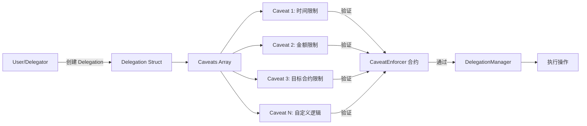
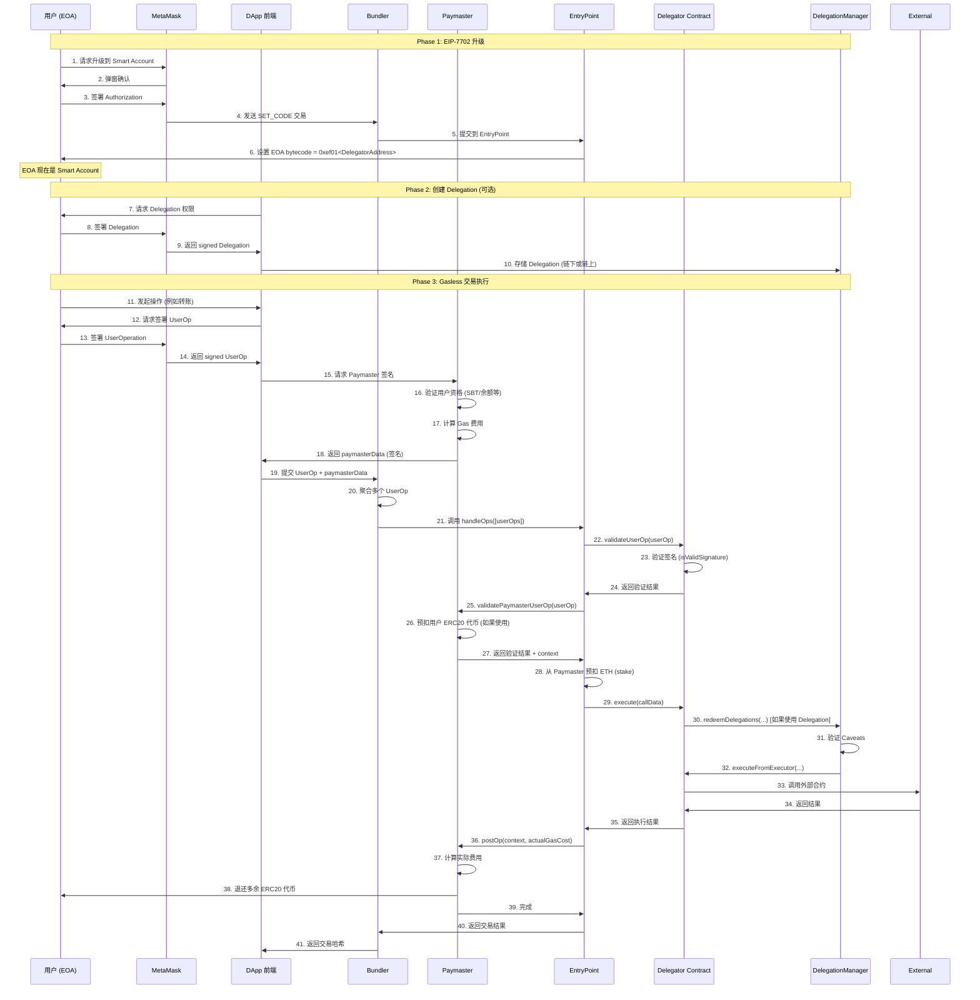

# MetaMask Delegation 技术深度解析

本文档回答关于 MetaMask EIP-7702 Delegation、Caveats、外部合约接入以及 Paymaster 交互的核心技术问题。

## 📋 目录

- [MetaMask signAuthorization 合约限制](#metamask-signauthorization-合约限制)
- [Caveats 技术原理与外部合约接入](#caveats-技术原理与外部合约接入)
- [Paymaster 与 Delegation 交互流程](#paymaster-与-delegation-交互流程)
- [MetaMask Delegator 合约能力分析](#metamask-delegator-合约能力分析)

---

## MetaMask signAuthorization 合约限制

### 问题：`client.signAuthorization()` 是否只能升级到 MetaMask 指定的合约？

**结论**：**是的**，但有nuance。

### 技术原理

根据 EIP-7702 标准和 MetaMask 实现：

1. **EIP-7702 授权机制**:
   ```typescript
   const authorization = await client.signAuthorization({
     contractAddress: DELEGATOR_ADDRESS, // 必须明确指定
     account
   })
   ```

2. **签名内容**:
   - `chainId`: 防止跨链重放攻击
   - `nonce`: 防止重复执行
   - `contractAddress`: **明确指定要委托的合约地址**
   - 签名者私钥

3. **链上验证**:
   - 当交易提交时，链会验证 `authorizationList` 中的签名
   - EOA 的 bytecode 会被设置为 `0xef01 00 <contractAddress>` (delegation designator)
   - 任何对 EOA 的调用都会被路由到这个特定的合约

### MetaMask 的默认 Delegator 合约

**Sepolia 测试网**:
- **地址**: `0x63c0c1

14B521E88A1A20bb92017177663496e32b` (MetaMask DeleGator)
- **部署**: MetaMask 官方部署
- **用途**: 标准的 EIP-7702 smart account 实现

**合约功能** (基于 `EIP7702DeleGatorCore.sol`):
```solidity
// 核心能力
- execute(Execution calldata _execution)              // 单笔执行
- execute(ModeCode _mode, bytes calldata _executionCalldata)  // 批量执行
- redeemDelegations(...)                              // 权限链执行
- disableDelegation(Delegation calldata _delegation)  // 禁用权限
- validateUserOp(PackedUserOperation calldata _userOp, ...) // ERC-4337 验证
- isValidSignature(bytes32 _hash, bytes calldata _signature) // ERC-1271 签名验证
```

### 能否使用自定义合约？

**理论上可以，但有限制**:

1. **用户可以选择任何合约地址**:
   ```typescript
   // 你可以部署自己的合约
   const authorization = await client.signAuthorization({
     contractAddress: "0xYourCustomContract",
     account
   })
   ```

2. **但合约必须符合标准**:
   - 实现 `IDeleGatorCore` 接口
   - 支持 ERC-4337 `validateUserOp`
   - 支持 ERC-1271 `isValidSignature`
   - 实现 `execute` 系列函数

3. **MetaMask UI 的限制**:
   - MetaMask 的 Smart Account UI **只识别官方 Delegator 合约**
   - 使用自定义合约时，UI 可能无法正确显示状态
   - 需要自行管理升级/降级

### 文档来源

- **EIP-7702 标准**: [https://eips.ethereum.org/EIPS/eip-7702](https://eips.ethereum.org/EIPS/eip-7702)
- **Viem EIP-7702 文档**: [https://viem.sh/experimental/eip7702/signAuthorization](https://viem.sh/experimental/eip7702/signAuthorization)
- **MetaMask Smart Accounts Kit**: [https://docs.metamask.io/smart-accounts-kit/](https://docs.metamask.io/smart-accounts-kit/)
- **Delegation Framework 合约**: [https://github.com/MetaMask/delegation-framework/tree/main/src/EIP7702](https://github.com/MetaMask/delegation-framework/tree/main/src/EIP7702)

---

## Caveats 技术原理与外部合约接入

### 什么是 Caveats？

**Caveats** (限制条件) 是 Delegation Framework 中的核心概念，用于限制被委托者的执行权限。

### 技术架构



### Delegation Struct

```solidity
struct Delegation {
    address delegate;        // 被委托者地址
    address delegator;       // 委托者地址
    bytes32 authority;       // 上级权限哈希
    Caveat[] caveats;        // 限制条件数组
    bytes32 salt;            // 防止哈希碰撞
    bytes signature;         // 委托者签名
}
```

### Caveat Struct

```solidity
struct Caveat {
    address enforcer;    // 强制执行合约地址 (CaveatEnforcer)
    bytes terms;         // 限制条件的编码参数
    bytes args;          // 执行时传入的参数
}
```

### Caveat Enforcer 合约示例

**时间限制 Caveat**:
```solidity
contract TimestampEnforcer is CaveatEnforcer {
    function beforeHook(
        bytes calldata terms,
        bytes calldata args,
        ModeCode mode,
        bytes calldata executionCallData,
        bytes32 delegationHash,
        address delegator,
        address delegate
    ) public view override {
        // 解析限制条件
        (uint256 validBefore, uint256 validAfter) = abi.decode(terms, (uint256, uint256));
        
        // 验证时间范围
        require(block.timestamp >= validAfter, "Too early");
        require(block.timestamp <= validBefore, "Too late");
    }
}
```

**金额限制 Caveat**:
```solidity
contract ValueLteEnforcer is CaveatEnforcer {
    function beforeHook(
        bytes calldata terms,
        bytes calldata args,
        ModeCode mode,
        bytes calldata executionCallData,
        bytes32 delegationHash,
        address delegator,
        address delegate
    ) public view override {
        // 解析最大金额
        uint256 maxValue = abi.decode(terms, (uint256));
        
        // 解析实际执行金额
        Execution[] memory executions = abi.decode(executionCallData, (Execution[]));
        uint256 totalValue = 0;
        for (uint256 i = 0; i < executions.length; i++) {
            totalValue += executions[i].value;
        }
        
        // 验证不超过最大值
        require(totalValue <= maxValue, "Value too high");
    }
}
```

### 如何接入外部合约？

#### 方案 1: 通过 Caveats 限制执行目标

**场景**: 允许被委托者只能调用特定的外部合约。

**实现**:
```solidity
// 部署 AllowedTargetsEnforcer
contract AllowedTargetsEnforcer is CaveatEnforcer {
    function beforeHook(
        bytes calldata terms,
        bytes calldata args,
        ModeCode mode,
        bytes calldata executionCallData,
        bytes32 delegationHash,
        address delegator,
        address delegate
    ) public view override {
        // 解析允许的目标合约列表
        address[] memory allowedTargets = abi.decode(terms, (address[]));
        
        // 解析实际执行的目标
        Execution[] memory executions = abi.decode(executionCallData, (Execution[]));
        
        for (uint256 i = 0; i < executions.length; i++) {
            bool isAllowed = false;
            for (uint256 j = 0; j < allowedTargets.length; j++) {
                if (executions[i].target == allowedTargets[j]) {
                    isAllowed = true;
                    break;
                }
            }
            require(isAllowed, "Target not allowed");
        }
    }
}

// 使用时
Caveat[] memory caveats = new Caveat[](1);
caveats[0] = Caveat({
    enforcer: allowedTargetsEnforcer,
    terms: abi.encode([uniswapRouter, aavePool]), // 只允许这两个合约
    args: ""
});
```

#### 方案 2: 通过自定义 Delegator 合约

**场景**: 需要更复杂的逻辑，例如集成 DeFi 协议。

**实现**:
```solidity
// 自定义 Delegator 继承 EIP7702DeleGatorCore
contract CustomDeFiDeleGator is EIP7702DeleGatorCore {
    constructor(
        IDelegationManager _delegationManager,
        IEntryPoint _entryPoint
    ) EIP7702DeleGatorCore(_delegationManager, _entryPoint, "CustomDeFi", "1") {}
    
    // 添加 DeFi 特定功能
    function swapOnUniswap(
        address tokenIn,
        address tokenOut,
        uint256 amountIn
    ) external onlyEntryPointOrSelf {
        // Uniswap 交换逻辑
        IUniswapRouter(uniswapRouter).swap(...);
    }
    
    function depositToAave(
        address token,
        uint256 amount
    ) external onlyEntryPointOrSelf {
        // Aave 存款逻辑
        IAavePool(aavePool).deposit(...);
    }
}
```

#### 方案 3: Relay + Delegation 混合模式 (推荐)

**架构**:
```
User → Relay Server → DelegationManager.redeemDelegations() 
                      → CaveatEnforcers (验证) 
                      → 外部合约 (Uniswap, Aave, etc.)
```

**优点**:
- ✅ 无需自定义 Delegator 部署
- ✅ 使用标准 MetaMask Delegator
- ✅ 灵活的后端逻辑
- ✅ 用户只需签名 Delegation，无需支付 Gas

**实现示例**:
```typescript
// 后端 Relay
async function executeDeFiOp(delegation: Delegation) {
  // 1. 验证 Delegation 签名
  const isValid = await delegationManager.verifyDelegation(delegation)
  if (!isValid) throw new Error("Invalid delegation")
  
  // 2. 构建执行参数
  const executions = [
    {
      target: uniswapRouter,
      value: 0n,
      callData: encodeFunctionData({
        abi: uniswapABI,
        functionName: "swap",
        args: [...]
      })
    }
  ]
  
  // 3. 通过 DelegationManager 执行
  const tx = await delegationManager.redeemDelegations(
    [encodeDelegationChain([delegation])],
    [MODE_DEFAULT],
    [encodeExecutions(executions)]
  )
  
  return tx.hash
}
```

### 业务可能性

**✅ 可以实现**:
1. **DeFi 聚合器**: 用户授权，Relay 自动在多个协议间优化收益
2. **自动化交易**: 预设条件触发交易（例如价格达到某值）
3. **订阅服务**: 定期从用户账户扣款（有 Caveats 限额）
4. **社交恢复**: 多个 guardian 通过 Delegation 帮用户恢复账户
5. **游戏内资产管理**: 游戏服务器代理用户执行链上操作

**❌ 限制**:
1. **必须遵循 Caveat 规则**: 无法绕过用户设置的限制
2. **需要用户签名**: 无法完全自动化，首次需要用户授权 Delegation
3. **Gas 成本**: Caveat 验证会增加 Gas 消耗

---

## Paymaster 与 Delegation 交互流程

### 核心问题

**Paymaster 合约和 EOA 的 delegation 之间如何交互？完整的 Gasless 流程是什么？**

### 完整流程图



### 详细步骤说明

#### Phase 1: EIP-7702 升级 (一次性)

**步骤 1-6: EOA 升级为 Smart Account**

```typescript
// 前端代码
const authorization = await client.signAuthorization({
  contractAddress: DELEGATOR_ADDRESS,
  account: userEOA
})

// MetaMask 发送特殊交易
const tx = await walletClient.sendTransaction({
  to: userEOA.address,
  authorizationList: [authorization],
  // 这笔交易将 EOA 的 bytecode 设置为 delegation designator
})
```

**链上效果**:
```
Before: EOA bytecode = 0x (空)
After:  EOA bytecode = 0xef01 00 <DelegatorContractAddress>
```

#### Phase 2: 创建 Delegation (可选，用于权限管理)

**步骤 7-10: 用户授权特定操作**

```typescript
// 创建 Delegation
const delegation: Delegation = {
  delegate: relayServerAddress,  // 被委托者
  delegator: userEOA.address,    // 委托者
  authority: ROOT_AUTHORITY,     // 根权限
  caveats: [
    {
      enforcer: timestampEnforcer,
      terms: abi.encode(["uint256", "uint256"], [validAfter, validBefore]),
      args: "0x"
    },
    {
      enforcer: valueLteEnforcer,
      terms: abi.encode(["uint256"], [maxValue]),
      args: "0x"
    }
  ],
  salt: randomBytes32(),
  signature: "0x" // 稍后签名
}

// 用户签署
const signature = await client.signTypedData({
  domain: delegationDomain,
  types: delegationTypes,
  primaryType: "Delegation",
  message: delegation
})

delegation.signature = signature
```

#### Phase 3: Gasless 交易执行

**步骤 11-14: 构建 UserOperation**

```typescript
// 用户操作
const userOp: UserOperation = {
  sender: userEOA.address,  // Smart Account 地址
  nonce: await entryPoint.getNonce(userEOA.address, 0),
  initCode: "0x",  // 已部署，无需 initCode
  callData: encodeFunctionData({
    abi: delegatorABI,
    functionName: "execute",
    args: [{
      target: recipientAddress,
      value: transferAmount,
      callData: "0x"
    }]
  }),
  accountGasLimits: packGasLimits(verificationGas, callGas),
  preVerificationGas: 21000n,
  gasFees: packGasFees(maxPriorityFee, maxFeePerGas),
  paymasterAndData: "0x",  // 稍后填充
  signature: "0x"  // 稍后签名
}

// 用户签署 UserOp
const userOpHash = await delegator.getPackedUserOperationTypedDataHash(userOp)
const userOpSignature = await userAccount.signMessage({ message: { raw: userOpHash } })
userOp.signature = userOpSignature
```

**步骤 15-18: Paymaster 验证和签名**

```solidity
// Paymaster 合约
function validatePaymasterUserOp(
    UserOperation calldata userOp,
    bytes32 userOpHash,
    uint256 maxCost
) external returns (bytes memory context, uint256 validationData) {
    // 1. 验证用户资格
    require(sbtToken.balanceOf(userOp.sender) > 0, "No SBT");
    
    // 2. 如果使用 ERC20 支付，预扣代币
    uint256 requiredTokens = (maxCost * exchangeRate) / 1e18;
    require(
        gasToken.transferFrom(userOp.sender, address(this), requiredTokens),
        "Token transfer failed"
    );
    
    // 3. 返回 context (用于 postOp 退款)
    context = abi.encode(userOp.sender, requiredTokens);
    
    // 4. 返回验证成功
    return (context, 0);
}
```

**步骤 19-21: Bundler 聚合和提交**

```typescript
// Bundler 聚合多个 UserOp
const userOps = [userOp1, userOp2, userOp3]

// 提交到 EntryPoint
const tx = await entryPoint.handleOps(userOps, bundlerAddress)
```

**步骤 22-24: Delegator 验证签名**

```solidity
// EIP7702DeleGatorCore.validateUserOp
function validateUserOp(
    PackedUserOperation calldata userOp,
    bytes32,  // userOpHash (ignored)
    uint256 missingAccountFunds
) external onlyEntryPoint returns (uint256 validationData) {
    // 1. 验证签名
    bytes32 typedDataHash = getPackedUserOperationTypedDataHash(userOp);
    validationData = _validateUserOpSignature(userOp, typedDataHash);
    
    // 2. 支付 EntryPoint 所需资金
    _payPrefund(missingAccountFunds);
    
    return validationData;  // 0 = 成功, 1 = 失败
}
```

**步骤 25-27: Paymaster 最终验证**

(同步骤 15-18，EntryPoint 调用)

**步骤 28-34: 执行操作**

```solidity
// EntryPoint 调用 Delegator.execute()
function execute(Execution calldata _execution) external payable onlyEntryPointOrSelf {
    _execute(_execution.target, _execution.value, _execution.callData);
}

// 如果使用 Delegation
function redeemDelegations(
    bytes[] calldata permissionContexts,
    ModeCode[] calldata modes,
    bytes[] calldata executionCallDatas
) external onlyEntryPointOrSelf {
    delegationManager.redeemDelegations(
        permissionContexts,
        modes,
        executionCallDatas
    );
}
```

**步骤 36-39: Paymaster 结算**

```solidity
function _postOp(
    PostOpMode mode,
    bytes calldata context,
    uint256 actualGasCost
) internal override {
    (address sender, uint256 preCharged) = abi.decode(context, (address, uint256));
    
    // 计算实际花费
    uint256 actualTokenCost = (actualGasCost * exchangeRate) / 1e18;
    
    // 退还多余代币
    if (preCharged > actualTokenCost) {
        gasToken.transfer(sender, preCharged - actualTokenCost);
    }
}
```

### Delegation 与 Paymaster 的关系

**关键点**:
1. **Delegation 是权限控制**, **Paymaster 是 Gas 支付**
2. 它们是**独立机制**，可以单独使用或组合使用
3. **组合使用场景**: 用户委托 Relay，Relay 使用 Paymaster 支付 Gas

**流程对比**:

| 场景 | Delegation | Paymaster | 谁支付 Gas | 谁执行操作 |
|------|-----------|-----------|-----------|-----------|
| 仅 Delegation | ✅ | ❌ | 用户/Relay | Relay (通过 Delegation) |
| 仅 Paymaster | ❌ | ✅ | Paymaster | 用户 |
| Delegation + Paymaster | ✅ | ✅ | Paymaster | Relay (通过 Delegation) |

---

## MetaMask Delegator 合约能力分析

### 合约地址 (Sepolia)

**EIP7702StatelessDeleGator**: `0x63c0c114B521E88A1A20bb92017177663496e32b`

### 核心能力

根据 `EIP7702DeleGatorCore.sol` 源码分析：

#### 1. 执行能力

```solidity
// 单笔执行
function execute(Execution calldata _execution) external payable

// 批量执行 (支持 EIP-5792)
function execute(ModeCode _mode, bytes calldata _executionCalldata) external payable
```

**支持的执行模式**:
- `CALLTYPE_SINGLE`: 单笔交易
- `CALLTYPE_BATCH`: 批量交易
- `EXECTYPE_DEFAULT`: 失败即回滚
- `EXECTYPE_TRY`: 尝试执行，失败不回滚

#### 2. Delegation 管理

```solidity
// 禁用 Delegation
function disableDelegation(Delegation calldata _delegation) external

// 启用 Delegation
function enableDelegation(Delegation calldata _delegation) external

// 检查 Delegation 状态
function isDelegationDisabled(bytes32 _delegationHash) external view returns (bool)

// 执行 Delegation
function redeemDelegations(
    bytes[] calldata _permissionContexts,
    ModeCode[] calldata _modes,
    bytes[] calldata _executionCallDatas
) external
```

#### 3. ERC-4337 集成

```solidity
// 验证 UserOperation
function validateUserOp(
    PackedUserOperation calldata _userOp,
    bytes32,
    uint256 _missingAccountFunds
) external returns (uint256 validationData)

// EntryPoint 存款管理
function addDeposit() external payable
function withdrawDeposit(address payable _withdrawAddress, uint256 _withdrawAmount) external
function getDeposit() external view returns (uint256)
```

#### 4. 签名验证

```solidity
// ERC-1271 签名验证
function isValidSignature(
    bytes32 _hash,
    bytes calldata _signature
) external view returns (bytes4 magicValue)
```

#### 5. 代币接收

```solidity
// ERC-721 接收
function onERC721Received(...) external view returns (bytes4)

// ERC-1155 接收
function onERC1155Received(...) external view returns (bytes4)
function onERC1155BatchReceived(...) external view returns (bytes4)
```

### 扩展性

**可以扩展的方向**:
1. **继承 `EIP7702DeleGatorCore`** 添加自定义功能
2. **部署新的 CaveatEnforcer** 实现自定义限制逻辑
3. **集成外部协议** (Uniswap, Aave, etc.) 通过 Delegation

**不可扩展的限制**:
1. 无法修改 MetaMask 官方部署的合约
2. 用户必须重新签署 `signAuthorization` 指向新合约
3. MetaMask UI 可能不支持自定义合约

### 开发文档

- **合约源码**: [delegation-framework/src/EIP7702/](https://github.com/MetaMask/delegation-framework/tree/main/src/EIP7702)
- **接口定义**: [delegation-framework/src/interfaces/](https://github.com/MetaMask/delegation-framework/tree/main/src/interfaces)
- **测试用例**: [delegation-framework/test/](https://github.com/MetaMask/delegation-framework/tree/main/test)
- **部署脚本**: [delegation-framework/script/](https://github.com/MetaMask/delegation-framework/tree/main/script)

---

## 总结

### 核心要点

1. **signAuthorization 限制**: 
   - 必须明确指定合约地址
   - 可以使用自定义合约，但需符合接口标准
   - MetaMask UI 仅识别官方合约

2. **Caveats 与外部合约**:
   - Caveats 提供细粒度权限控制
   - 可以限制目标合约、金额、时间等
   - 推荐使用 Relay + Delegation 模式接入外部合约

3. **Paymaster-Delegation 交互**:
   - 两者独立但可组合
   - Delegation 管理权限，Paymaster 管理 Gas
   - 完整 Gasless 流程包含 EIP-7702 升级、UserOp 签名、Paymaster 验证、执行、结算

4. **MetaMask Delegator 能力**:
   - 支持单笔/批量执行
   - 支持 Delegation 管理
   - 完整 ERC-4337 集成
   - 可扩展但有限制

### 实施建议

**Phase 1**: 使用 MetaMask 官方 Delegator + Relay
**Phase 2**: 添加 Caveats 实现权限控制
**Phase 3**: 部署 Paymaster 实现真正的 Gasless
**Phase 4**: (可选) 部署自定义 Delegator 扩展能力
